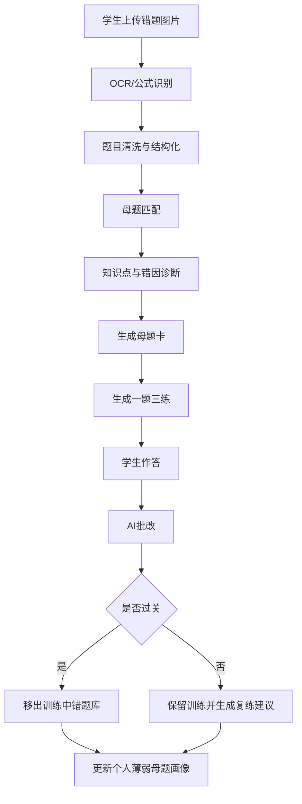
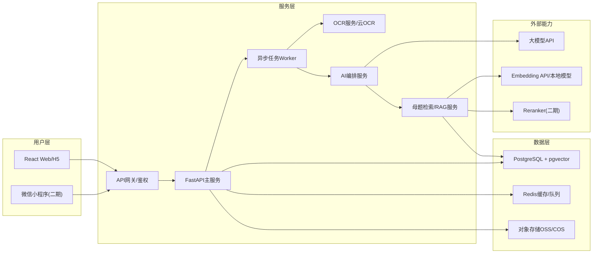
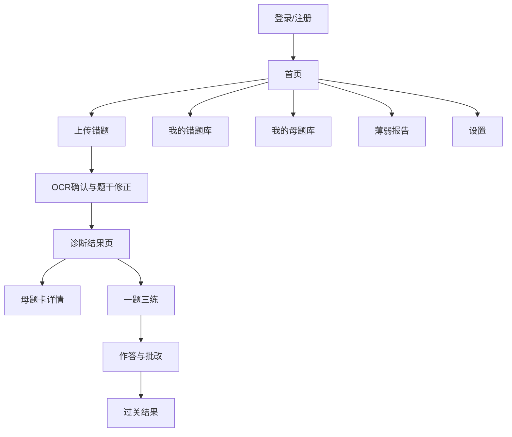
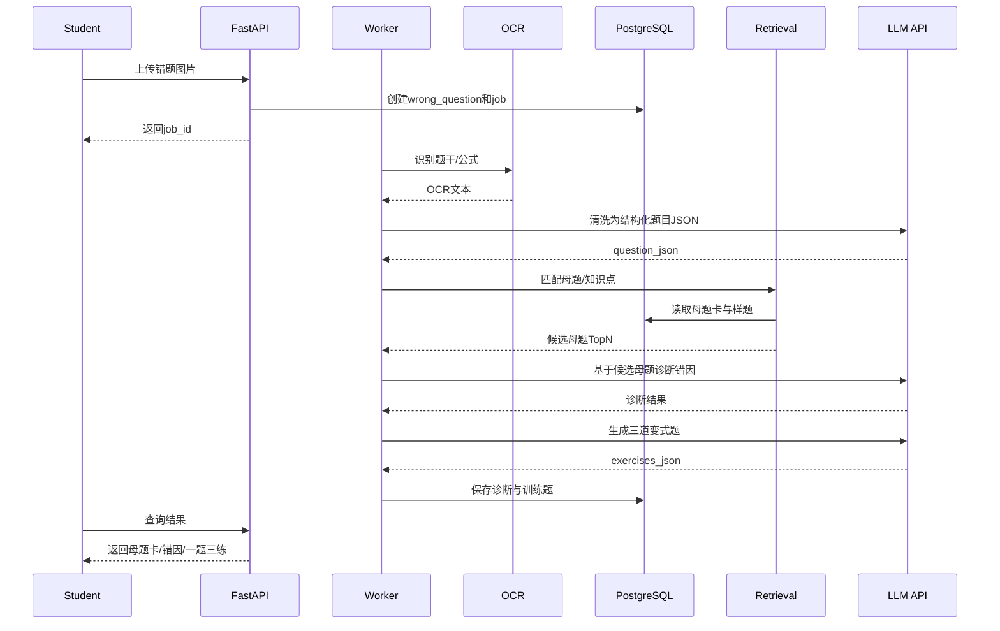
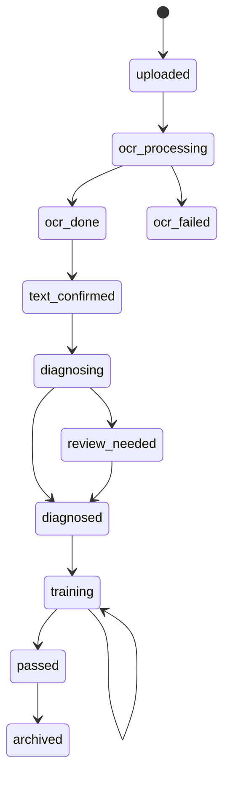
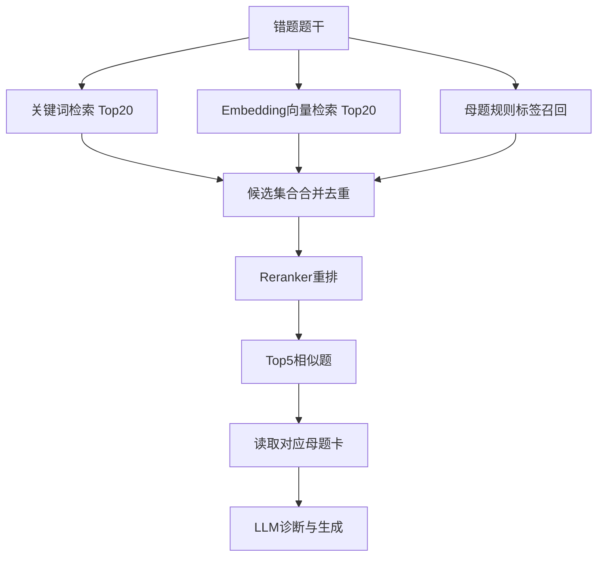

# AI母题错题系统前后端完整设计

## 1. 产品定位

本系统第一版不做“拍照搜答案 App”，也不做全科大题库。第一版只做一个尖刀场景：

**高中数学函数与导数错题母题闭环。**

核心定位：

> 错一道，通一类。把一道错题变成一个可掌握的母题模型。

和作业帮类产品的差异：

| 维度 | 作业帮类产品 | 本系统 |
| --- | --- | --- |
| 用户心智 | 拍照搜题、看答案、看解析 | 错题诊断、母题抽象、一题三练、过关移除 |
| 内容范围 | 全科、大题库、大而全 | 高中数学函数与导数，小而深 |
| 核心结果 | 解决这一题 | 掌握这一类题 |
| 学习闭环 | 看完解析通常结束 | 做对变式题并过关才结束 |
| 护城河 | 题库规模、品牌、流量 | 母题体系、错因标签、过关数据、个人薄弱模型 |

第一版目标只有一个：学生上传一道数学错题，系统返回母题、错因、三道变式题，并记录是否过关。

## 2. 用户角色与核心流程

### 2.1 角色

| 角色 | 第一版权限 | 后续扩展 |
| --- | --- | --- |
| 学生 | 上传错题、查看诊断、完成一题三练、查看个人母题库 | 复习计划、错因趋势、错题导出 |
| 老师 | 第一版只预留数据结构，不做完整端 | 班级错题聚类、讲评提纲、同母题训练卷 |
| 管理员/教研 | 维护母题库、审核变式题、查看系统质量 | 教研工作台、批量导入题库 |

### 2.2 学生主流程



第一版允许 OCR 不完美：用户上传后必须有“人工修正题干”步骤，保证诊断链路可用。

## 3. 总体技术架构

第一版推荐云端轻量版：不买 GPU，调用外部 LLM API；后端负责流程编排、数据存储、检索、缓存和权限。



第一版单体优先，不拆复杂微服务。代码上按模块拆包，部署上一个 API 服务加一个 Worker 即可。等用户量和任务量上来，再把 OCR、RAG、LLM 编排拆成独立服务。

## 4. 前端设计

### 4.1 技术栈

| 模块 | 推荐 |
| --- | --- |
| Web 框架 | React + TypeScript |
| 构建 | Vite |
| 路由 | React Router |
| 状态管理 | Zustand 或 TanStack Query |
| UI | Ant Design Mobile / shadcn 风格自研组件 |
| 数学公式 | KaTeX / MathJax |
| 图片裁剪 | react-easy-crop |
| 图表 | ECharts |

第一版优先做移动端 Web，浏览器直接使用。小程序二期再做，避免早期被平台能力和审核节奏拖住。

### 4.2 页面信息架构



### 4.3 核心页面

#### 首页

展示今日训练状态，不做营销首页。

关键区域：

- 今日待过关错题数
- 最近上传错题
- 薄弱母题 Top 3
- 主按钮：上传错题
- 次按钮：继续训练

#### 上传错题页

能力：

- 拍照或上传图片
- 支持裁剪题目区域
- 选择学段、专题：默认“高中数学/函数与导数”
- 上传后生成处理任务
- 展示 OCR 处理中状态

交互约束：

- 第一版只支持“单题清晰截图”
- 多题试卷、整页扫描进入二期
- 图片必须可重新裁剪、重新上传

#### OCR确认页

这是第一版成功率的关键页面。

内容：

- 左侧/上方显示原图
- 右侧/下方显示 OCR 题干
- 学生可编辑题干
- 可补充“我的答案/错解步骤”
- 可标记“老师打叉/不会做/算错”

提交后进入诊断。

#### 诊断结果页

必须避免直接变成“答案页”。页面结构建议：

1. 母题识别结果  
   显示母题名称、匹配置信度、识别信号。

2. 知识点定位  
   显示知识点路径，例如：函数 > 导数 > 含参函数单调性讨论。

3. 错因分析  
   用标签表达：概念不清、审题偏差、分类讨论遗漏、计算错误、方法选择错误。

4. 标准解题模型  
   给出步骤模板，不只给本题答案。

5. 一题三练入口  
   主按钮进入训练。

#### 母题卡详情页

母题卡是产品资产，字段必须稳定：

- 母题名称
- 适用题型
- 识别信号
- 核心知识点
- 标准解法步骤
- 常见错因
- 口诀/提醒
- 典型例题
- 变式方向
- 已掌握/待巩固状态

#### 一题三练页

训练题分三档：

| 题目 | 目标 |
| --- | --- |
| 第1题 | 同结构低难度，验证是否理解母题 |
| 第2题 | 同母题中等难度，替换参数或条件 |
| 第3题 | 稍有变形，验证迁移能力 |

作答方式：

- 第一版支持文本/拍照上传答案
- 数学公式可用纯文本、LaTeX 或图片
- 提交后 AI 批改，返回“是否过关 + 复发错因”

#### 我的错题库

筛选：

- 待诊断
- 训练中
- 已过关
- 按知识点
- 按母题
- 按错因

列表项不展示长解析，只展示：原题缩略图、母题名称、错因标签、状态、最近训练时间。

#### 薄弱报告

第一版只做可解释报告：

- 最常错的母题 Top 5
- 最常见错因 Top 5
- 函数/导数专题掌握雷达图
- 本周过关数量
- 建议复习的母题卡

## 5. 后端设计

### 5.1 技术栈

| 模块 | 推荐 |
| --- | --- |
| API 框架 | FastAPI |
| ORM/迁移 | SQLAlchemy 2.x + Alembic |
| 数据库 | PostgreSQL 16 + pgvector |
| 缓存/队列 | Redis + RQ/Celery |
| 文件存储 | 本地开发用 MinIO，上线用 OSS/COS |
| OCR | PaddleOCR 服务或云 OCR |
| LLM | 外部 API，封装 OpenAI-compatible client |
| 日志 | structlog / JSON logs |
| 部署 | Docker Compose 起步 |

选择 FastAPI 的原因：AI/OCR/RAG 编排主要在 Python 生态，PaddleOCR、embedding、向量处理和后续评测都更顺手。

### 5.2 后端模块

```text
app/
  api/
    auth.py
    uploads.py
    wrong_questions.py
    mother_questions.py
    exercises.py
    reports.py
    admin.py
  core/
    config.py
    security.py
    logging.py
  domain/
    diagnosis.py
    mastery.py
    grading.py
    mother_matching.py
  integrations/
    ocr_client.py
    llm_client.py
    embedding_client.py
    storage_client.py
  repositories/
    wrong_question_repo.py
    mother_question_repo.py
    exercise_repo.py
  workers/
    tasks.py
  models/
    *.py
```

### 5.3 AI处理流水线



### 5.4 母题匹配策略

第一版采用“规则 + LLM + 人工母题库”，二期接入轻量 RAG。

#### V1：无完整RAG

输入：清洗后的题干、用户错解、专题。

匹配步骤：

1. 按专题过滤母题：只在函数/导数母题中找。
2. 关键词规则召回：参数、导数、单调区间、恒成立、极值、切线、零点等。
3. LLM 在候选母题中选择最匹配母题。
4. 若置信度低于阈值，进入“待人工审核”。

#### V2：轻量RAG

增加：

- 题目 embedding
- pgvector TopK 相似题召回
- BM25/全文检索召回
- 母题标签过滤
- reranker 重排

最终分数：

```text
score = 0.35 * keyword_score
      + 0.35 * vector_score
      + 0.20 * mother_tag_score
      + 0.10 * llm_confidence
```

### 5.5 LLM输出约束

所有 LLM 调用必须输出 JSON，并通过 schema 校验。不合格则自动重试一次，再失败则进入人工审核。

诊断输出示例：

```json
{
  "mother_question_id": "MQ-D-005",
  "mother_question_name": "含参函数单调性讨论",
  "confidence": 0.86,
  "knowledge_points": ["导数", "单调性", "分类讨论"],
  "error_causes": [
    {
      "code": "missed_case_split",
      "label": "分类讨论遗漏",
      "evidence": "题目含参数a，学生答案未讨论导函数零点与区间关系"
    }
  ],
  "solution_model": {
    "steps": [
      "求导并整理导函数",
      "找导函数零点或符号变化点",
      "讨论参数导致的区间位置关系",
      "按题目要求写出单调区间或参数范围"
    ],
    "warning": "不要把存在性条件当成恒成立条件"
  },
  "needs_human_review": false
}
```

## 6. 数据库设计

### 6.1 核心表

#### users

| 字段 | 类型 | 说明 |
| --- | --- | --- |
| id | uuid pk | 用户ID |
| phone | varchar nullable | 手机号 |
| email | varchar nullable | 邮箱 |
| password_hash | varchar nullable | 密码哈希 |
| role | enum | student/teacher/admin |
| display_name | varchar | 昵称 |
| grade | varchar | 年级 |
| created_at | timestamptz | 创建时间 |

#### knowledge_points

| 字段 | 类型 | 说明 |
| --- | --- | --- |
| id | uuid pk | 知识点ID |
| parent_id | uuid nullable | 父知识点 |
| subject | varchar | math |
| stage | varchar | senior_high |
| name | varchar | 知识点名称 |
| description | text | 定义 |
| formulas | jsonb | 公式 |
| common_mistakes | jsonb | 常见错误 |

#### mother_questions

| 字段 | 类型 | 说明 |
| --- | --- | --- |
| id | uuid pk | 母题ID |
| code | varchar unique | 例如 MQ-D-005 |
| name | varchar | 母题名称 |
| subject | varchar | 学科 |
| topic | varchar | 函数/导数 |
| difficulty | int | 1-5 |
| recognition_signals | jsonb | 识别信号 |
| solution_steps | jsonb | 解题步骤 |
| common_error_causes | jsonb | 常见错因 |
| mnemonic | text | 口诀/提醒 |
| review_status | enum | draft/reviewed/published |
| embedding | vector nullable | 二期启用 |

#### questions

| 字段 | 类型 | 说明 |
| --- | --- | --- |
| id | uuid pk | 题目ID |
| mother_question_id | uuid fk | 所属母题 |
| stem | text | 题干 |
| answer | text | 标准答案 |
| analysis | text | 解析 |
| difficulty | int | 难度 |
| source_type | varchar | manual/past_exam/generated |
| source_meta | jsonb | 年份、地区、学校 |
| embedding | vector nullable | 二期启用 |

#### wrong_questions

| 字段 | 类型 | 说明 |
| --- | --- | --- |
| id | uuid pk | 错题ID |
| user_id | uuid fk | 学生ID |
| image_url | text | 原图 |
| ocr_text | text | OCR文本 |
| corrected_text | text | 用户修正题干 |
| student_wrong_answer | text nullable | 学生错解 |
| subject | varchar | math |
| topic | varchar | function_derivative |
| matched_mother_id | uuid nullable | 匹配母题 |
| diagnosis | jsonb | 错因诊断 |
| status | enum | uploaded/ocr_done/diagnosed/training/passed/review_needed |
| confidence | numeric | 母题匹配置信度 |
| created_at | timestamptz | 创建时间 |

#### exercise_variants

| 字段 | 类型 | 说明 |
| --- | --- | --- |
| id | uuid pk | 变式题ID |
| wrong_question_id | uuid fk | 对应错题 |
| mother_question_id | uuid fk | 对应母题 |
| level | int | 1/2/3 |
| stem | text | 题干 |
| answer | text | 答案 |
| analysis | text | 解析 |
| generation_prompt_version | varchar | 生成模板版本 |
| review_status | enum | ai_generated/reviewed/rejected |

#### student_answers

| 字段 | 类型 | 说明 |
| --- | --- | --- |
| id | uuid pk | 作答ID |
| user_id | uuid fk | 用户 |
| exercise_variant_id | uuid fk | 变式题 |
| answer_text | text | 学生答案 |
| answer_image_url | text nullable | 答案图片 |
| grading_result | jsonb | AI批改结果 |
| is_correct | boolean | 是否正确 |
| submitted_at | timestamptz | 提交时间 |

#### mastery_records

| 字段 | 类型 | 说明 |
| --- | --- | --- |
| id | uuid pk | 掌握记录 |
| user_id | uuid fk | 用户 |
| mother_question_id | uuid fk | 母题 |
| wrong_question_id | uuid nullable | 来源错题 |
| mastery_score | numeric | 0-100 |
| status | enum | weak/training/passed/mastered |
| attempts | int | 训练次数 |
| last_practiced_at | timestamptz | 最近训练 |

### 6.2 后续扩展表

- classes：班级
- teacher_students：师生关系
- class_wrong_question_stats：班级错题聚类
- prompt_runs：AI调用审计
- review_tasks：人工审核任务
- subscriptions：会员订阅

## 7. API设计

### 7.1 鉴权

| 方法 | 路径 | 说明 |
| --- | --- | --- |
| POST | /api/auth/register | 注册 |
| POST | /api/auth/login | 登录 |
| POST | /api/auth/refresh | 刷新token |
| GET | /api/me | 当前用户 |

### 7.2 上传与诊断

| 方法 | 路径 | 说明 |
| --- | --- | --- |
| POST | /api/uploads/presign | 获取上传地址 |
| POST | /api/wrong-questions | 创建错题记录 |
| GET | /api/wrong-questions/{id} | 查看错题详情 |
| PATCH | /api/wrong-questions/{id}/ocr | 修正OCR题干 |
| POST | /api/wrong-questions/{id}/diagnose | 触发诊断 |
| GET | /api/jobs/{job_id} | 查询任务状态 |

创建错题请求：

```json
{
  "image_url": "https://oss.example.com/wq/1.png",
  "subject": "math",
  "stage": "senior_high",
  "topic": "function_derivative"
}
```

诊断结果响应：

```json
{
  "wrong_question_id": "uuid",
  "status": "diagnosed",
  "mother_question": {
    "id": "uuid",
    "code": "MQ-D-005",
    "name": "含参函数单调性讨论"
  },
  "knowledge_points": ["导数", "单调性", "分类讨论"],
  "error_causes": ["分类讨论遗漏", "导函数符号判断错误"],
  "confidence": 0.86,
  "next_action": "start_training"
}
```

### 7.3 母题与训练

| 方法 | 路径 | 说明 |
| --- | --- | --- |
| GET | /api/mother-questions/{id} | 母题卡详情 |
| GET | /api/mother-questions | 母题列表 |
| POST | /api/wrong-questions/{id}/variants | 生成一题三练 |
| GET | /api/wrong-questions/{id}/variants | 查看变式题 |
| POST | /api/exercise-variants/{id}/answers | 提交答案 |
| GET | /api/student-answers/{id} | 查看批改 |

### 7.4 错题库与报告

| 方法 | 路径 | 说明 |
| --- | --- | --- |
| GET | /api/wrong-questions | 我的错题库 |
| PATCH | /api/wrong-questions/{id}/status | 状态更新 |
| GET | /api/reports/me/weak-mothers | 薄弱母题 |
| GET | /api/reports/me/error-causes | 错因统计 |
| GET | /api/reports/me/weekly | 周报 |

### 7.5 管理端

| 方法 | 路径 | 说明 |
| --- | --- | --- |
| POST | /api/admin/mother-questions | 新建母题 |
| PATCH | /api/admin/mother-questions/{id} | 更新母题 |
| POST | /api/admin/questions/import | 导入样题 |
| GET | /api/admin/review-tasks | 审核任务 |
| POST | /api/admin/review-tasks/{id}/approve | 通过审核 |

## 8. 后台任务与状态机

### 8.1 任务类型

| 任务 | 同步/异步 | 说明 |
| --- | --- | --- |
| 图片上传 | 同步 | 生成上传地址 |
| OCR识别 | 异步 | 可能耗时数秒 |
| 题目结构化 | 异步 | LLM清洗 |
| 母题匹配 | 异步 | 规则/检索/LLM |
| 变式题生成 | 异步 | LLM生成后schema校验 |
| AI批改 | 异步或同步 | 短答案可同步，图片答案异步 |

### 8.2 错题状态机



## 9. RAG设计

### 9.1 第一版原则

第一版可以不做完整 RAG，但数据库和接口必须按 RAG 可升级设计。先做人工母题库 + 规则召回 + LLM 选择，避免一开始处理 1000 张试卷导致项目失焦。

第一版数据准备：

- 30 个高频母题：函数 15 个，导数 15 个
- 每个母题 5-10 道样题
- 每个母题必须包含识别信号、步骤、错因、口诀、变式方向

### 9.2 二期轻量RAG

检索链路：



RAG 不是为了让模型“记住试卷”，而是让模型回答前查证题库、母题库、知识点库。

## 10. AI提示词与质量控制

### 10.1 提示词版本管理

每类 AI 调用都必须有 prompt_version：

- ocr_clean_v1
- mother_match_v1
- diagnosis_v1
- variant_generate_v1
- answer_grade_v1

prompt_runs 表记录输入、输出、模型、token、耗时、错误，便于回放和优化。

### 10.2 质量闸门

| 环节 | 质量规则 |
| --- | --- |
| OCR | 题干少于20字或公式明显缺失，要求用户修正 |
| 母题匹配 | 置信度低于0.65进入人工审核 |
| 变式题生成 | 三题必须同母题、难度递进、答案可验证 |
| AI批改 | 必须指出正误、错误步骤、复练建议 |
| 解析 | 高风险题显示“建议老师复核” |

### 10.3 人工审核后台

第一版至少需要轻量管理端：

- 查看低置信度错题
- 修改母题匹配
- 审核 AI 生成的变式题
- 标记坏题/错解析
- 将优质用户错题沉淀为样题

## 11. 安全、隐私与合规

教育场景涉及未成年人，第一版就要做基本合规设计：

- 不宣传“拍照秒出答案”，只宣传错因诊断、母题训练、过关检测
- 图片私有访问，OSS URL 使用短期签名
- 手机号、邮箱脱敏展示
- 用户数据按 user_id 隔离
- 支持删除账号和删除错题图片
- LLM 调用前尽量不传手机号、姓名等个人信息
- 后台操作留审计日志
- 高频上传限流，防止滥用成搜题工具

## 12. 非功能需求

### 12.1 MVP指标

| 指标 | 目标 |
| --- | --- |
| 早期用户 | 10-100人 |
| 单题诊断耗时 | 30-90秒可接受 |
| Web首屏 | 2秒内 |
| 普通API | p95 < 500ms |
| 任务成功率 | > 95% |
| 母题匹配准确率 | 人工抽检 > 80% |
| 一题三练可用率 | 人工抽检 > 85% |

### 12.2 可用性

MVP 可接受单区部署，目标 99% 可用。正式商用再做多实例、备份恢复和服务降级。

### 12.3 成本

早期主要成本不是服务器，而是 OCR 和 LLM API：

- 对同一错题诊断结果做缓存
- 变式题生成结果保存，不重复生成
- 免费用户限制每日上传数
- 失败重试最多一次
- 管理端可查看每用户 token 成本

## 13. 部署方案

### 13.1 本地开发

```text
frontend: Vite dev server
backend: FastAPI
db: PostgreSQL + pgvector
cache: Redis
storage: MinIO
worker: Celery/RQ worker
```

### 13.2 云端MVP

| 资源 | 建议 |
| --- | --- |
| 服务器 | 4核16GB，200GB SSD |
| 系统 | Ubuntu 22.04/24.04 |
| 数据库 | PostgreSQL + pgvector，可先同机后迁云数据库 |
| 存储 | OSS/COS |
| OCR | 云 OCR 或独立 PaddleOCR 服务 |
| LLM | 外部大模型 API |
| GPU | 不需要 |

### 13.3 后期增强

当出现以下信号再升级：

- API 成本显著高于 GPU 租用成本
- 用户并发导致 LLM 排队明显
- 学校/机构要求私有化部署
- 数据合规要求不能外发题目

升级路径：

- 独立 OCR 服务
- 独立 RAG 服务
- Qdrant/Milvus 替代或补充 pgvector
- vLLM 部署 Qwen 14B/32B
- 多实例 API + Worker 横向扩展

## 14. 关键架构决策

### ADR-001：第一版采用 FastAPI 单体模块化架构

状态：Accepted

背景：MVP 目标是快速验证母题闭环，不是高并发平台。系统需要大量 Python AI/OCR/RAG 生态集成。

决策：使用 FastAPI 构建单体后端，内部按 API、domain、integrations、workers 分层。部署为 API 服务 + Worker。

后果：

- 正面：开发快、部署简单、AI 生态顺手。
- 负面：后续高并发时需要拆服务。
- 替代方案：Spring Boot 更适合 Java 团队，但 AI 编排会更重。

### ADR-002：第一版使用 PostgreSQL + pgvector

状态：Accepted

背景：系统既有用户、错题、母题等关系数据，也需要后续向量检索。

决策：PostgreSQL 作为主库，预留 pgvector 字段。第一版可不用向量，二期直接启用。

后果：

- 正面：减少组件数量，关系查询和向量检索能共存。
- 负面：海量向量和复杂召回时不如专用向量库。
- 替代方案：Qdrant/Milvus 二期作为独立检索服务接入。

### ADR-003：第一版不自建大模型GPU服务

状态：Accepted

背景：当前重点是验证需求和闭环，自建 GPU 会增加成本、运维和模型调优负担。

决策：MVP 调用外部 LLM API；GPU 只在成本、隐私或并发需求明确后再引入。

后果：

- 正面：上线快，不买 GPU，效果更稳定。
- 负面：API 成本随用量增长，数据外发需脱敏与合规控制。
- 替代方案：本地版可用 Ollama/LM Studio 跑 Qwen 8B/14B 做演示。

### ADR-004：第一版先做人工母题库，不处理1000张试卷

状态：Accepted

背景：未清洗试卷数据需要 OCR、切题、标注、审核，工程量大且会拖慢验证。

决策：先人工整理 30 个母题和 300 道样题，跑通闭环；二期再扩展试卷库。

后果：

- 正面：产品更聚焦，母题质量可控。
- 负面：早期覆盖范围有限。
- 替代方案：直接导入大量试卷风险高，容易变成低质量搜题库。

## 15. 30天MVP实施计划

### 第1周：基础骨架

- React Web 移动端框架
- FastAPI 项目骨架
- 用户登录
- 图片上传
- PostgreSQL 表结构
- 错题创建与状态流转

### 第2周：母题库与OCR确认

- 录入 30 个母题卡
- 每个母题录入 5-10 道样题
- 接入 OCR 或模拟 OCR
- OCR 确认/修正页面
- 管理端母题维护初版

### 第3周：AI诊断

- 题目结构化 prompt
- 母题匹配 prompt
- 错因诊断 prompt
- schema 校验与失败重试
- 诊断结果页

### 第4周：一题三练与过关

- 变式题生成
- 学生作答
- AI 批改
- 过关状态更新
- 我的错题库
- 薄弱母题报告

## 16. 第一版验收标准

不用“功能多不多”验收，而用这 8 个指标：

1. 上传一道函数/导数错题后，能准确识别母题。
2. 母题卡能让学生理解“我错的是哪一类”。
3. 错因诊断能指出可行动的问题，而不是泛泛而谈。
4. 三道变式题围绕同一母题，且难度递进。
5. AI 批改能识别复发错因。
6. 做对三题后，错题状态能自动过关。
7. 学生愿意上传下一道错题。
8. 后台能沉淀母题、错因和训练数据。

## 17. 不做清单

第一版明确不做：

- 全科支持
- 整张试卷批量识别
- 直播课/视频课
- 大规模试卷库导入
- 自研大模型训练
- 自建 GPU 推理集群
- 家长端完整监督系统
- 老师端完整 SaaS

这些不是永远不做，而是等“母题闭环”验证成立后再做。

## 18. 最终建议

最小可行系统应该是：

```text
React Web
+ FastAPI
+ PostgreSQL + pgvector
+ OSS/COS
+ OCR
+ 外部LLM API
+ 30个函数/导数母题
+ 300道样题
+ 一题三练闭环
```

产品不要先证明“我们能解很多题”，而要证明：

> 一个学生上传一道错题后，系统能稳定帮他找到背后的母题，并通过三道变式题判断他是否真正掌握。

只要这个闭环成立，后续的 RAG、老师端、班级报告、自有模型和商业化才有根。
